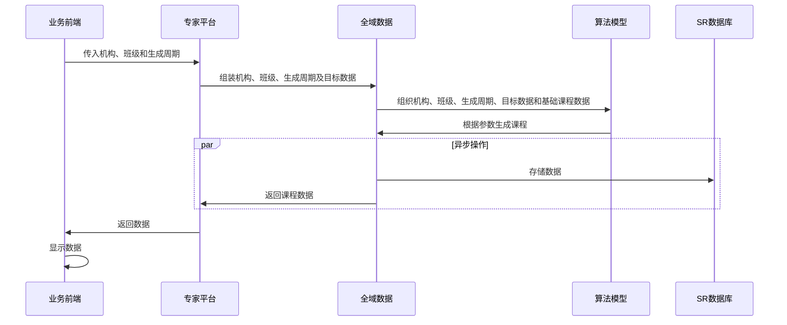
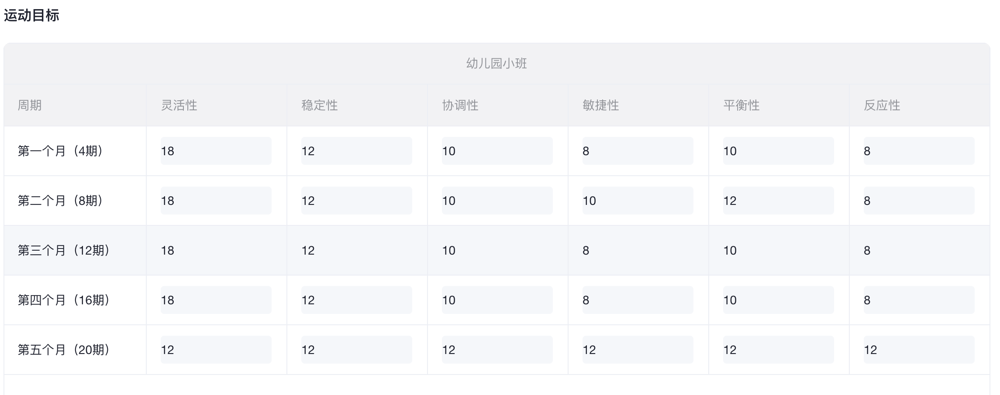
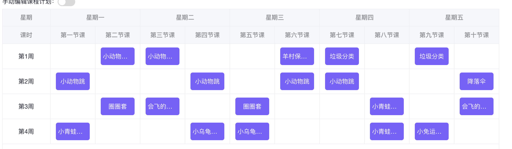

# 运动动态目标设置

## [业务]()流程时序图

```mermaid
sequenceDiagram
    participant A as 业务前端
    participant B as 专家平台
    participant C as 全域数据
    participant D as 算法模型
    participant E as SR数据库

    A->>B: 传入机构、班级和生成周期
    B->>C: 组装机构、班级、生成周期及目标数据
    C->>D: 组织机构、班级、生成周期、目标数据和基础课程数据
    D->>C: 根据参数生成课程
  
    par 异步操作
        C->>E: 存储数据
        C->>B: 返回课程数据
    end
  
    B->>A: 返回数据
    A->>A: 显示数据
```

## 入参：保持不变

## 约束条件：保持不变

## 目标：动态运动目标——动态上传

## 出参：课程表

