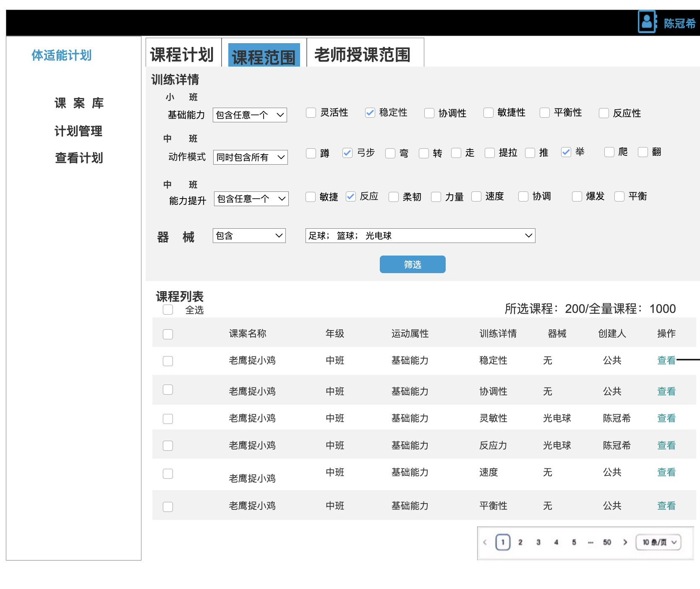
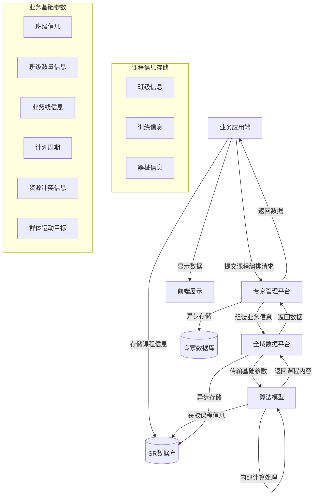
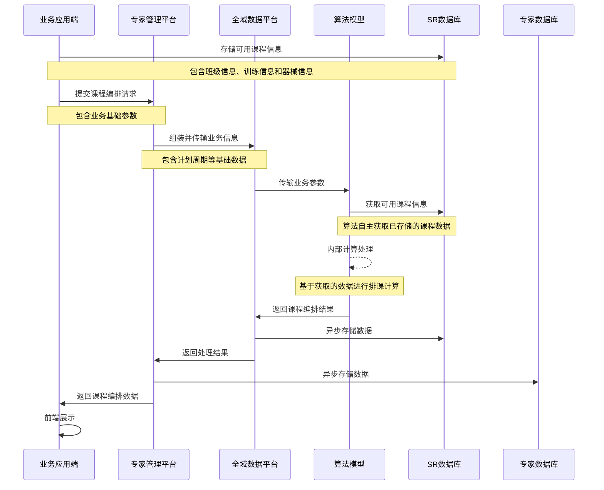

# 教育线体育课程编排需求说明书

## 需求背景

幼儿园依据体育课程编排要求，对幼儿园的体育课程进行编排，要求如下：
每个班级必须安排体育课程，且体育课程的数量与班级的数量相同。排列的课程表不能存在资源冲突。系统需要支持灵活的课程编排和动态调整，同时保证资源的合理分配和使用效率。

## 功能需求

### 功能清单

| 序号 | 功能内容     | 优先级 | 描述                                 |
| ---- | ------------ | ------ | ------------------------------------ |
| 1    | 排课功能     | P0     | 支持全园和单班级两种模式的课程编排   |
| 2    | 资源冲突管理 | P0     | 实时检测和预防资源冲突，提供解决方案 |

## 业务流程图

## 课程编排的数据范围是幼儿园圈选的最新课程数据；



### 业务流程图



#### 系统时序图



### 数据字典

1. 业务线信息

   - business_line_id: 业务线唯一标识
   - business_line_name: 业务线名称
   - business_type: 业务类型（体育课程）
   - status: 状态（活动/禁用）
2. 班级信息

   - class_id: 班级唯一标识
   - grade_type: 年级类型（大班/中班/小班）
   - class_name: 班级名称
   - student_count: 学生数量
   - head_teacher: 班主任信息
3. 课程信息

   - course_scope_id: 课程范围唯一标识
   - business_line_id: 关联的业务线ID
   - scope_name: 课程范围名称
   - grade_type: 适用年级（大班/中班/小班）
   - training_categories: 训练类别列表
4. 训练类别映射

   - 小班：
     - 类型：基础能力
     - 项目：[灵活性、稳定性、协调性、敏捷性、平衡性、反应性]
   - 中班：
     - 类型：动作模式
     - 项目：[蹲、弓步、弯、转、走、提拉、推、举、爬、翻]
   - 大班：
     - 类型：能力提升
     - 项目：[敏捷、反应、柔韧、力量、速度、协调、爆发、平衡]
5. 器械信息

   - equipment_id: 器械唯一标识
   - equipment_name: 器械名称
   - equipment_type: 器械类型（器械、器材）
   - equipment_count: 器械数量
   - equipment_status: 器械状态（可用/不可用）
6. 资源冲突信息

   - conflict_id: 冲突唯一标识
   - conflict_type: 冲突类型（教师/场地/器械）
   - conflict_info: 冲突信息（教师ID/场地ID/器械ID）
   - conflict_resolution: 冲突解决方案（人工/自动）
7. 群体运动目标

   - target_id: 目标唯一标识
   - target_type: 目标类型（能力提升/灵活性/稳定性/协调性/敏捷性/平衡性/反应性）
   - target_value: 目标值

## 数据模型

### 排课功能：面向全园生成运动课程

#### 模型入参

- 班级信息：年级和班级信息
- 课程信息：已排课程信息
- 业务线信息：业务线信息

#### 约束条件

1. 课程目标

   - 在初始化的运动目标基础上，选择的运动类别，增加+2个运动课时
2. 计划周期

   - 计划周期是并的关系
   - 正常上课时间内，一个自然日安排两次体育课程
3. 老师资源

   - 输入老师和其对应的授课年级
   - 老师资源在统一时间内只能安排一个老师上课
   - 教师每个工作日的工作时间为8小时
4. 场地资源

   - 输入场地和允许使用数量
   - 场地在统一时间内只能安排一个课程使用
   - 场地可使用时间不限
5. 器械资源

   - 输入器械和允许使用数量
   - 一节课程允许使用多种器械
   - 器械可使用时间不限
6. 课程资源

   - 正常上课时间内，一个自然日安排两次体育课程
   - 园区已经圈选的课程

#### 目标函数

1. 课程目标

   - 课程的安排满足目标的维度要求
   - 课程的安排满足目标的数量要求
2. 最大化课程覆盖率

   - 确保所有班级都能按要求安排体育课程
   - 确保每个训练类别在计划周期内得到合理分配
3. 最小化资源冲突

   - 教师资源不冲突
   - 场地资源不冲突
   - 最小化器械资源冲突
4. 最优化课程分布

   - 保证课程时间分布均匀性
   - 确保不同训练类别的合理间隔
   - 优化各年级课程的时间分配

#### 模型输出

课程表格式：

```json
{
  "schedule_id": "unique_id",
  "class_schedules": [
    {
      "date": "2024-01-01",
      "time_slot": "上午",
      "class_info": {
        "grade": "大班",
        "class_name": "大班1班"
      },
      "course_info": {
        "training_type": "能力提升",
        "training_item": "敏捷"
      },
      "resources": {
        "teacher": "张老师",
        "venue": "室外操场",
        "equipment": ["跳绳", "雪糕桶"]
      }
    }
  ]
}
```

#### 模型评估

1. 合规性检查

   - 检查每个班级的课程数量是否满足运动目标要求
   - 验证训练类别是否符合年级对应关系
   - 确认资源分配是否存在冲突
2. 均衡性评估

   - 评估课程时间分布的均匀程度
   - 计算各类训练项目的分配比例
   - 分析资源利用率
3. 资源利用率
   - 分析资源利用率
       
4. 质量评分
   得分 = w1*合规性得分 + w2*均衡性得分 + w3*资源利用率得分
   其中：w1 = 0.4, w2 = 0.3, w3 = 0.3

   a. 合规性得分（0-100分）

   - 基础规则：初始分100分，违反一条约束扣10分
   - 检查清单：
     - 班级课程数量是否符合要求（-10分/个）
     - 训练类别是否符合年级对应关系（-10分/个）

   b. 均衡性得分（0-100分）

   - 时间分布评分（50分）：
     - 计算所有课程时间间隔的标准差(σ)
     - 标准差分数 = 50 * (1 - σ/最大可能标准差)
   - 训练类别分布评分（50分）：
     - 计算各训练类别出现频率与理想均匀分布的偏差
     - 偏差率 = 实际偏差/最大可能偏差
     - 分数 = 50 * (1 - 偏差率)

   c. 资源利用率得分（0-100分）

   - 教师资源利用率（40分）：
     - 实际授课时长/可用时长 * 40
     - 可用时长计算：每位老师每个工作日的标准工作时间（8小时）乘以工作日天数
   - 场地资源利用率（30分）：
     - 实际使用时长/可用时长 * 30
     - 可用时长计算：同老师工作时间
   - 器械资源利用率（30分）：
     - 平均使用率 = Σ(各器械使用时长/可用时长)/器械总数
     - 分数 = 平均使用率 * 30
     - 可用时长计算：同老师工作时间
5. 特殊规则
   如果发生以下情况，直接整体分数为50分：
   - 教师资源冲突
   - 场地资源冲突
  
6. 判定标准

   - 优秀：总分 ≥ 90
   - 良好：75 ≤ 总分 < 90
   - 合格：60 ≤ 总分 < 75
   - 不合格：总分 < 60
   - 不合格：人员冲突、场地冲突总分数 < 60
   - 合格以上内容，直接进行输出

### 生成计划：面向某个班级生成运动课程

#### 模型入参

- 班级信息：年级和班级信息
- 课程信息：已排课程信息
- 业务线信息：业务线信息

#### 约束条件

1. 课程目标

   - 在初始化的运动目标基础上，选择的运动类别，增加+2个运动课时
2. 计划周期

   - 计划周期是并的关系
   - 正常上课时间内，一个自然日安排两次体育课程
3. 课程资源

   - 正常上课时间内，一个自然日安排两次体育课程

#### 目标函数

1. 课程目标

   - 课程的安排满足目标的维度要求
   - 课程的安排满足目标的数量要求
2. 最大化课程覆盖率

   - 确保所有班级都能按要求安排体育课程
   - 确保每个训练类别在计划周期内得到合理分配

3. 最优化课程分布

   - 保证课程时间分布均匀性
   - 确保不同训练类别的合理间隔
   - 优化各年级课程的时间分配

#### 模型输出

课程表格式：

```json
{
  "schedule_id": "unique_id",
  "class_schedules": [
    {
      "date": "2024-01-01",
      "time_slot": "上午",
      "class_info": {
        "grade": "大班",
        "class_name": "大班1班"
      },
      "course_info": {
        "training_type": "能力提升",
        "training_item": "敏捷"
      },
      "resources": {
        "teacher": "",
        "venue": "",
        "equipment": ["跳绳", "雪糕桶"]
      }
    }
  ]
}
```

#### 模型评估

评估标准与全园生成运动课程相同。

## 非功能性需求

### 性能需求

- 系统响应时间：普通操作响应时间<5秒，复杂排课计算<10秒
- 并发处理能力：支持100个用户同时操作
- 数据处理能力：支持1000个班级的同时排课

### 可扩展性需求

- 支持新增课程类型和评分规则
- 支持自定义资源类型和约束条件

### 系统异常处理

1. 数据验证错误

   - 输入参数校验失败
   - 数据格式不符合要求
   - 处理方式：返回具体错误信息，提示用户修正
2. 业务逻辑错误

   - 资源冲突无法解决
   - 课程编排不满足约束条件
   - 处理方式：提供可选的解决方案，允许人工介入
3. 系统运行错误

   - 服务器响应超时
   - 数据库连接失败
   - 处理方式：自动重试，失败后通知系统管理员

### 数据同步机制

1. 实时同步
   - 课程编排结果
   - 资源分配状态
   - 同步方式：消息队列推送

### 数据一致性保证

1. 状态管理
   - 课程状态流转
   - 资源状态变更
   - 保证方式：状态机制
